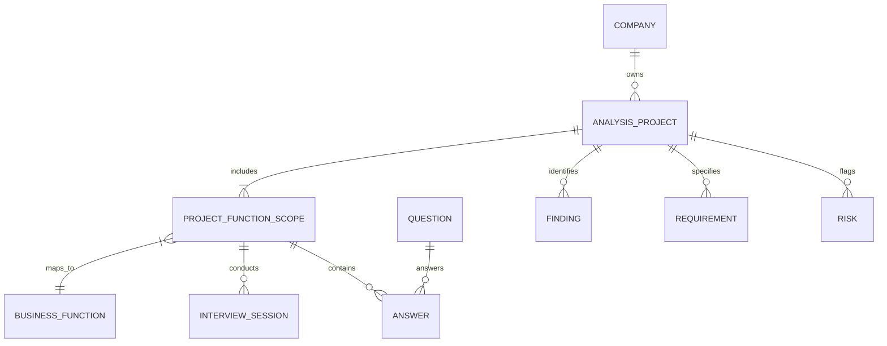

# ERP CRM Discovery — Faz-0 Mimari Blueprint ve Teknik Yol Haritası

**Doküman Versiyonu:** 1.1.0 (Revize)  
**Tarih:** 19 Ağustos 2026  
**Durum:** Mimari Revizyon ve Onay Taslağı (Faz-0)  
**Rol:** Uygulama Geliştirici / Implementation Agent  

---

## 1. Proje Amacı

**ERP CRM Discovery**, Türkiye'deki ve global ölçekteki orta ve büyük ölçekli işletmelerde ERP (Kurumsal Kaynak Planlama) ve CRM (Müşteri İlişkileri Yönetimi) implementasyonları öncesinde, proje yöneticileri ve süreç danışmanlarının kurumsal bilgi ve süreç ihtiyaçlarını sistematik, yapılandırılmış ve tekrar kullanılabilir biçimde toplamalarını sağlayan masaüstü **ERP/CRM Ön Analiz Uygulamasıdır**.

### Temel Misyon
> **"Sahadan doğru, yapılandırılmış ve tekrar kullanılabilir süreç bilgisi toplamak."**

Bu ürün bir ERP veya CRM transactional operasyon sistemi **değildir**; kurumsal dönüşüm projelerinin başlangıcındaki keşif (discovery), süreç olgunluk analizi, kapsam belirleme, darboğaz/risk tespiti ve fonksiyonel şartname hazırlık aşamalarını dijitalleştiren tarafsız (vendor-neutral) bir analiz aracıdır.

---

## 2. V1 Kapsamı

V1 sürümünde hedeflenen temel yetenekler ve sınırlar:

1. **Firma & Analiz Projesi Yönetimi:**
   - Firma profili (sektör, çalışan sayısı, ciro büyüklüğü, mevcut yazılım altyapısı, lokasyonlar).
   - Analiz projeleri oluşturma, listeleme, durum takibi, arşivleme ve silme.
2. **Kapsam ve İş Fonksiyonu Seçimi:**
   - 30+ standart iş fonksiyonu kataloğundan proje kapsamına göre seçim yapabilme.
   - Şirkete özel departman / iş fonksiyonu ekleyebilme ve organizasyonel departman adları ile iş fonksiyonlarını eşleştirebilme.
   - Her seçilen fonksiyon için durum (`not_started`, `in_progress`, `completed`) ve ilerleme takibi.
3. **Yapılandırılmış Soru Motoru (Question Engine):**
   - Uygulama kodundan tamamen ayrıştırılmış, deklaratif JSON tabanlı soru paketleri (Bundled Question Packs).
   - Zengin soru tipleri (Tekli seçim, Çoklu seçim, Açık uçlu metin, Ölçek/Puanlama, Tablo/Matris, Evet/Hayır).
   - Temel koşullu görünürlük / dallanma (Branching/Conditional Visibility - örn: "Üretim var mı? Hayır -> Üretim detaylarını atla").
4. **Keşif ve Görüşme Oturumları (Discovery Sessions):**
   - Departman / fonksiyon bazlı görüşme kayıtları.
   - Soru bazında cevap, olgunluk puanı, not, tespit (finding), fonksiyonel gereksinim (requirement) ve süreç riski (risk) etiketleme.
   - İlerleme takibi (% tamamlanma, fonksiyon bazında cevaplanma oranları).
5. **Lokal Veri Kalıcılığı ve Kesintisiz Çalışma (Save & Continue):**
   - Standart işletim sistemi AppData dizininde yönetilen lokal gömülü SQLite veritabanı.
   - Otomatik kaydetme (debounced autosave) ve kullanıcının uygulamayı kapatıp istediği an kaldığı yerden devam edebilmesi.
6. **Dışa Aktarma & Raporlama (Export & Reporting):**
   - Düzenlenebilir Microsoft Word formatında (.docx) kapsamlı Ön Analiz Raporu üretimi.
   - Özet PDF Raporu üretimi.
   - Çevrimdışı proje yedekleme ve paylaşımı için tek dosya JSON / Proje Arşivi (.ecdp) dışa/içe aktarımı.
7. **Platform & Dağıtım Prensibi:**
   - Windows 10/11 x64 öncelikli, son kullanıcıdan hiçbir runtime/sunucu kurulumu istemeyen kullanıcı dostu kurulum paketi (Primary: Setup Installer, Secondary: Portable Package).
   - Sıfır sunucu bağımlılığı, %100 çevrimdışı (offline-first).

---

## 3. V1 Dışı Kapsam

Aşağıdaki özellik ve bileşenler **kesinlikle V1 kapsamı dışındadır**:

- **Yapay Zekâ (AI / LLM) Özellikleri:** AI tabanlı süreç analizi, otomatik şartname üretimi veya LLM entegrasyonları V1'de yer almayacaktır.
- **Harici / Merkezi Sunucular:** Django, FastAPI, Express/Node.js backend, PostgreSQL/MySQL sunucuları, Redis, Docker container gereksinimleri bulunmayacaktır.
- **Bulut & SaaS Servisleri:** Cloud veritabanı senkronizasyonu, uzaktan kimlik doğrulama (auth0, supabase vb.), çok kullanıcılı eşzamanlı web soket oturumları.
- **Telemetri ve Analitik:** Kullanıcı kullanım istatistikleri, hata izleme servisleri (Sentry vb.) veya uzaktan veri toplayıcılar.
- **Çevrimiçi Soru Marketi / Uzaktan Güncelleme:** Soru paketlerinin internetten dinamik indirilmesi veya uzaktan senkronizasyonu V1'de yoktur; tüm paketler uygulama ile birlikte yerel (bundled) gelir.
- **ERP Vendor Entegrasyonları:** Canlı ERP sistemlerine (SAP RFC, Odoo API, Logo Objects vb.) doğrudan veri çekme/yazma konnektörleri.

---

## 4. Mevcut Repository ve Ortam Durumu

Sistem üzerinde yapılan salt-okunur ortam incelemesi sonuçları:

| Bileşen | Durum / Versiyon | Değerlendirme |
| :--- | :--- | :--- |
| **Çalışma Dizini** | `/home/selim/projects/erp-crm-discovery` | Dizin incelendi; henüz proje iskeleti açılmamış, temiz durumda. |
| **Git Durumu** | Henüz `git init` yapılmamış | Versiyon kontrolü FAZ-1 başında başlatılacaktır. |
| **İşletim Sistemi** | Ubuntu 22.04.5 LTS (x86_64) | Linux geliştirme ana ortamı. |
| **Node.js** | `v20.20.0` (LTS) | Modern JS/TS araçları ve Vite için tam uyumlu. |
| **npm** | `10.8.2` | Paket yöneticisi hazır. |
| **pnpm** | Yüklü değil | Proje standardı olarak `npm` veya `npx` kullanılacaktır. |
| **Rust Derleyicisi** | `rustc 1.93.0` (2026-01-19) | Modern Rust 2021/2024 edition özellikleri destekleniyor. |
| **Cargo** | `cargo 1.93.0` | Rust paket yöneticisi hazır. |
| **Tauri CLI** | Globalde kurulu değil | `package.json` üzerinden `@tauri-apps/cli` ile yerel çalıştırılacaktır. |
| **Rustup Targets** | `x86_64-unknown-linux-gnu`, `wasm32-unknown-unknown` | Linux geliştirme hedefleri mevcut. |

---

## 5. Önerilen Teknoloji Stack'i ve SQLite Yaklaşımı

```
+-----------------------------------------------------------------------+
|                       FRONTEND (UI / Presentation)                    |
|  React 19 / TypeScript 5.x / Vite 6.x / Vanilla CSS (Design Tokens)   |
|  Icons: Lucide-React  |  Docs: docx (npm)  |  PDF: @react-pdf/renderer |
+-----------------------------------------------------------------------+
                                   |
                  Tauri 2 IPC & Plugin Architecture
                                   |
+-----------------------------------------------------------------------+
|                    CORE DESKTOP ENGINE (Tauri 2 / Rust)               |
|  - Tauri 2 Core Runtime                                               |
|  - Database Access: @tauri-apps/plugin-sql (SQLite Driver / sqlx)     |
|  - File System & Dialogs: @tauri-apps/plugin-fs, plugin-dialog        |
|  - Question Pack Loader & Validator (Serde JSON)                      |
+-----------------------------------------------------------------------+
                                   |
+-----------------------------------------------------------------------+
|                        STORAGE (Offline Persistence)                  |
|  - Embedded SQLite Database (OS AppData/erp_discovery.db)             |
|  - Standalone Project Archives (.ecdp / JSON Export)                  |
|  - Bundled Question Packs (Read-Only / Community JSON Schema)         |
+-----------------------------------------------------------------------+
```

### SQLite Erişim Stratejisi Değerlendirmesi:

V1 gereksinimlerimiz: **basit CRUD işlemleri, transaction desteği, şema migration yönetimi, debounced autosave, lokal SQLite ve düşük bakım maliyeti** üzerinedir.

#### 1. Primary Recommendation (Birincil Tercih): `@tauri-apps/plugin-sql` + SQLite
- **Neden?** 
  - Tauri 2'nin resmi, topluluk tarafından en yoğun test edilen ve desteklenen SQL eklentisidir.
  - Rust tarafında güçlü ve asenkron `sqlx` motorunu kullanır.
  - `sqlite:erp_discovery.db` bağlantı dizesi ile doğrudan çalışır; gömülü migration desteği (`Migration` nesneleri) sunar.
  - TypeScript arayüzünden doğrudan tip güvenli sorgu ve transaction yürütme imkânı vererek Rust-IPC boilerplate kodunu minimuma indirir.
  - Topluluk projelerinde dış katkı sağlayan geliştiricilerin projeyi anlamasını ve geliştirmesini kolaylaştırır.
- **Karar:** V1 için birincil veritabanı erişim mekanizması olarak `@tauri-apps/plugin-sql` (SQLite) benimsenecektir.

#### 2. Alternative (Alternatif): Özel `rusqlite` + Tauri Custom Commands
- **Ne Zaman Değerlendirilir?**
  - İleride SQLite düzeyinde özel C eklentileri (örn: SQLCipher ile şifreli DB), karmaşık vektör indeksleri veya Rust tarafında yoğun veri dönüşümü/rapor agregasyonu gerektiğinde alternatif olarak devreye alınabilir.

---

## 6. Önerilen Yüksek Seviye Mimari

Mimari, **Clean Architecture** ve **Separation of Concerns** prensiplerine uygun olarak yapılandırılmıştır:

```
[ Domain Layer (Domain Modelleri, Question Schemas, Validation Rules) ]
                           ↑
[ Application Layer (Discovery Engine, Autosave Hook, Report Services) ]
                           ↑
[ Infrastructure & UI Layer (Tauri SQL Plugin, File System, React Views) ]
```

### Katman Sorumlulukları:
1. **Presentation (React UI):**
   - Sayfa durumları, kullanıcı form girişleri, anlık ilerleme çubukları, autosave bildirimleri.
   - Doğrudan işletim sistemiyle etkileşime girmez; tüm veri ve dosya işlemlerini Tauri eklentileri ve IPC komutları üzerinden yürütür.
2. **Data & Persistence Katmanı (`@tauri-apps/plugin-sql`):**
   - İlişkisel bütünlük (Foreign Keys, Cascade Rules).
   - Otomatik şema versiyonlama ve migrasyonlar.
   - SQLite WAL (Write-Ahead Logging) modu ile eşzamanlı okuma/yazma güvenliği.
3. **Domain & Content Katmanı (`question-packs/`):**
   - Tamamen deklaratif JSON soru katalogları.
   - Yazılım kodundan bağımsız, süreç danışmanlarının kolayca katkı sağlayabileceği format.

---

## 7. Domain Modeli ve İlerleme (Progress) Takibi

Organizasyonel yapı (şirket departmanları) ile evrensel iş fonksiyonları birbirinden net biçimde ayrılmıştır. Proje ilerlemesini izlemek için fonksiyon bazında durum takibi modele eklenmiştir.

```
Company (Firma)
    ↓
AnalysisProject (Analiz Projesi)
    ↓
SelectedBusinessFunction / Scope (Kapsamdaki İş Fonksiyonu & Durum)
    ↓
AnalysisSession / Progress (Görüşme Kayıtları & İlerleme)
    ↓
Question (Soru Paketi Tanımı)
    ↓
Answer (Cevap + Olgunluk Puanı + Danışman Notu)
    ↓
Findings / Requirements / Risks (Bulgular, İhtiyaçlar, Riskler)
```



### Temel Varlıklar ve Durum Kuralları:

1. **Company (Firma):** Analiz yapılan kurumun ana künyesi.
2. **AnalysisProject (Analiz Projesi):** Belirli bir dönemde yürütülen ön analiz çalışması (örn: "2026 ERP Modernizasyon Analizi"). Durumlar: `DRAFT`, `IN_PROGRESS`, `COMPLETED`, `ARCHIVED`.
3. **SelectedBusinessFunction / ProjectFunctionScope (Kapsam Eşleme & Durum):**
   - Projede hangi iş fonksiyonunun analiz edileceği ve şirketteki departman karşılığı.
   - **İlerleme Durumu:** Her seçilen fonksiyon en az şu 3 duruma sahiptir:
     - `not_started`: Fonksiyona ait hiçbir soru henüz cevaplanmadı.
     - `in_progress`: Fonksiyon sorularının bir kısmı cevaplandı veya görüşme notu girildi.
     - `completed`: Fonksiyona ait tüm zorunlu sorular tamamlandı ve danışman tarafından incelendi.
   - **Tamamlanma Oranı:** `answered_questions_count / total_questions_count * 100` formülüyle dinamik hesaplanır.
4. **Question Pack (Soru Paketi):** Soru metni, gerekçesi, soru tipi, seçenekleri ve ERP etki alanlarını tanımlayan deklaratif kütüphane.
5. **Answer (Cevap):** Proje bazında verilen cevap, 1-5 arası opsiyonel olgunluk skoru, danışman notu.
6. **Finding / Requirement / Risk:** Analiz sırasında sorulardan veya serbest görüşmelerden türetilen yapısal çıktılar.

---

## 8. Soru Paketi (Question Pack) Mimarisi ve Açık Kaynak Felsefesi

Uygulama kodundan tamamen izole edilen soru paketleri, **uygulama ile birlikte yerel olarak paketlenen (Bundled Question Packs)** deklaratif JSON dosyaları halinde saklanır.

### Açık Kaynak Katkı Prensibi:
> **"Süreç danışmanları ve sektör uzmanlarının soru paketi geliştirmek için Rust, React veya TypeScript bilmesi gerekmez."**

Katkıcılar yalnızca standart JSON şemasına uygun dosyalar ekleyerek veya düzenleyerek yeni sektörel soru paketleri oluşturabilir.

### V1 Paket Kapsamı ve Kuralları:
- **Bundled Packs:** Tüm temel soru paketleri repository içinde `question-packs/` dizininde versiyonlanır ve uygulama derlenirken statik varlık olarak pakete dahil edilir.
- **V1'de Olmayanlar:** İnternetten dinamik soru paketi indirme, online pazar yeri (marketplace), uzaktan güncelleme servisi V1'de yer almayacaktır. Tüm içerik çevrimdışı ve yereldir.

### Örnek Dizin Yapısı:
```text
question-packs/
├── manifest.json                  # Paket versiyonları, desteklenen diller
├── tr/
│   ├── metadata.json
│   ├── management.json            # Üst Yönetim & Strateji
│   ├── sales.json                 # Satış & Pazarlama & CRM
│   ├── procurement.json           # Satın Alma & Tedarik Zinciri
│   ├── warehouse.json             # Depo & Stok Yönetimi
│   ├── production.json            # Üretim & Üretim Planlama
│   ├── quality.json               # Kalite Kontrol & Güvence
│   ├── finance.json               # Finans, Muhasebe & Maliyet
│   ├── human_resources.json       # İK, Bordro & Yetkinlik
│   └── it_infrastructure.json     # BT Altyapısı & Bilgi Güvenliği
└── en/
    ├── metadata.json
    └── ...
```

### Soru Şeması (JSON Schema - YAGNI Uyumlu):

```json
{
  "id": "Q_PROD_PLAN_001",
  "version": "1.0",
  "function_code": "PRODUCTION_PLANNING",
  "process": "Ana Üretim Çizelgeleme",
  "sub_process": "Kapasite ve Malzeme İhtiyaç Planlaması",
  "title": "Üretim planlaması hangi yöntemle ve hangi periyotta yapılmaktadır?",
  "description": "Şirketin siparişe göre (MTO) veya stoğa göre (MTS) üretim planlama kurgusunu belirler.",
  "rationale": "ERP implementasyonunda MRP II / APS modüllerinin kapsamını ve parametre karmaşıklığını belirleyen kritik sorudur.",
  "answer_type": "single_choice",
  "options": [
    { "id": "mto", "label": "Tamamen Müşteri Siparişine Göre (MTO)" },
    { "id": "mts", "label": "Tamamen Stoğa / Tahmine Göre (MTS)" },
    { "id": "hybrid", "label": "Hibrit (Yarı mamul stoğa, nihai montaj siparişe)" },
    { "id": "manual", "label": "Herhangi bir sisteme dayanmadan manuel/Excel ile" }
  ],
  "criticality": "high",
  "affected_erp_modules": ["PP", "MM", "SD"],
  "conditional_visibility": {
    "depends_on_question": "Q_COMPANY_PROD_EXISTS",
    "operator": "equals",
    "value": "yes"
  },
  "tags": ["mrp", "planlama", "kapasite"]
}
```

---

## 9. SQLite Veri Modeli Taslağı

Lokal SQLite veritabanında (`erp_discovery.db`) uygulanacak şema taslağı:

```sql
-- 1. Şirketler
CREATE TABLE companies (
    id TEXT PRIMARY KEY,
    name TEXT NOT NULL,
    industry TEXT,
    employee_count_range TEXT,
    annual_turnover_range TEXT,
    current_software_notes TEXT,
    created_at DATETIME DEFAULT CURRENT_TIMESTAMP,
    updated_at DATETIME DEFAULT CURRENT_TIMESTAMP
);

-- 2. Analiz Projeleri
CREATE TABLE analysis_projects (
    id TEXT PRIMARY KEY,
    company_id TEXT NOT NULL,
    title TEXT NOT NULL,
    target_solution_type TEXT NOT NULL, -- 'ERP', 'CRM', 'ERP_AND_CRM'
    status TEXT NOT NULL DEFAULT 'IN_PROGRESS', -- 'DRAFT', 'IN_PROGRESS', 'COMPLETED', 'ARCHIVED'
    lead_consultant_name TEXT,
    notes TEXT,
    created_at DATETIME DEFAULT CURRENT_TIMESTAMP,
    updated_at DATETIME DEFAULT CURRENT_TIMESTAMP,
    FOREIGN KEY(company_id) REFERENCES companies(id) ON DELETE CASCADE
);

-- 3. Proje Kapsamındaki İş Fonksiyonları, Departman Eşleştirmesi ve Durum Takibi
CREATE TABLE project_function_scopes (
    id TEXT PRIMARY KEY,
    project_id TEXT NOT NULL,
    function_code TEXT NOT NULL,
    company_department_name TEXT NOT NULL,
    department_lead_name TEXT,
    is_included INTEGER NOT NULL DEFAULT 1,
    status TEXT NOT NULL DEFAULT 'NOT_STARTED', -- 'NOT_STARTED', 'IN_PROGRESS', 'COMPLETED'
    completion_percentage REAL NOT NULL DEFAULT 0.0,
    custom_order INTEGER DEFAULT 0,
    created_at DATETIME DEFAULT CURRENT_TIMESTAMP,
    updated_at DATETIME DEFAULT CURRENT_TIMESTAMP,
    FOREIGN KEY(project_id) REFERENCES analysis_projects(id) ON DELETE CASCADE,
    UNIQUE(project_id, function_code)
);

-- 4. Görüşme / Keşif Oturumları
CREATE TABLE interview_sessions (
    id TEXT PRIMARY KEY,
    project_id TEXT NOT NULL,
    function_code TEXT NOT NULL,
    session_date DATE NOT NULL,
    interviewee_names TEXT NOT NULL,
    interviewee_titles TEXT,
    interviewer_name TEXT NOT NULL,
    session_notes TEXT,
    created_at DATETIME DEFAULT CURRENT_TIMESTAMP,
    FOREIGN KEY(project_id) REFERENCES analysis_projects(id) ON DELETE CASCADE
);

-- 5. Cevaplar
CREATE TABLE answers (
    id TEXT PRIMARY KEY,
    project_id TEXT NOT NULL,
    question_id TEXT NOT NULL,
    function_code TEXT NOT NULL,
    selected_options TEXT, -- JSON Array: ["opt1", "opt2"]
    text_value TEXT,
    numeric_value REAL,
    consultant_notes TEXT,
    maturity_rating INTEGER CHECK(maturity_rating BETWEEN 1 AND 5),
    is_completed INTEGER NOT NULL DEFAULT 0,
    updated_at DATETIME DEFAULT CURRENT_TIMESTAMP,
    FOREIGN KEY(project_id) REFERENCES analysis_projects(id) ON DELETE CASCADE,
    UNIQUE(project_id, question_id)
);

-- 6. Bulgular, İhtiyaçlar ve Riskler (Findings, Requirements, Risks)
CREATE TABLE project_findings (
    id TEXT PRIMARY KEY,
    project_id TEXT NOT NULL,
    function_code TEXT NOT NULL,
    question_id TEXT,
    category TEXT NOT NULL, -- 'FINDING', 'REQUIREMENT', 'RISK', 'INTEGRATION_NEED'
    severity TEXT NOT NULL DEFAULT 'MEDIUM', -- 'LOW', 'MEDIUM', 'HIGH', 'CRITICAL'
    title TEXT NOT NULL,
    description TEXT NOT NULL,
    recommended_action TEXT,
    created_at DATETIME DEFAULT CURRENT_TIMESTAMP,
    FOREIGN KEY(project_id) REFERENCES analysis_projects(id) ON DELETE CASCADE
);

-- İndeksler
CREATE INDEX idx_answers_project_function ON answers(project_id, function_code);
CREATE INDEX idx_function_scopes_project ON project_function_scopes(project_id);
CREATE INDEX idx_findings_project ON project_findings(project_id);
```

---

## 10. Uygulama Klasör Yapısı Önerisi

```text
erp-crm-discovery/
├── docs/                                  # Mimari ve dokümantasyon
│   └── FAZ_0_ARCHITECTURE_BLUEPRINT.md
├── question-packs/                        # Yerel soru paketleri (Bundled)
│   ├── manifest.json
│   ├── tr/
│   └── en/
├── src-tauri/                             # Rust & Tauri Desktop Engine
│   ├── Cargo.toml
│   ├── tauri.conf.json
│   ├── icons/
│   └── src/
│       ├── main.rs                        # Tauri runtime giriş noktası
│       └── lib.rs                         # Tauri builder & plugin registrations
├── src/                                   # React Frontend
│   ├── index.html
│   ├── package.json
│   ├── tsconfig.json
│   ├── vite.config.ts
│   └── src/
│       ├── main.tsx
│       ├── App.tsx
│       ├── index.css                      # Global design system & tokens
│       ├── components/                    # Yeniden kullanılabilir UI bileşenleri
│       │   ├── common/                    # Button, Input, Modal, Badge, ProgressBar
│       │   ├── layout/                    # Header, Sidebar, SaveStatusIndicator
│       │   └── questions/                 # QuestionCard, SingleChoice, MultiChoice, Matrix
│       ├── views/                         # Ekranlar
│       │   ├── Home/                      # Proje listesi & yeni proje
│       │   ├── ProjectSetup/              # Firma bilgisi & kapsam belirleme
│       │   ├── DiscoveryWorkspace/        # Soru cevaplama ana ekranı
│       │   ├── FindingsAndRisks/          # Bulgular & İhtiyaçlar listesi
│       │   └── Reports/                   # DOCX / PDF dışa aktarma
│       ├── db/                            # Tauri SQL plugin istemcisi & migration'lar
│       │   ├── client.ts
│       │   └── migrations.ts
│       ├── services/                      # Uygulama servisleri
│       │   ├── projectService.ts
│       │   ├── answerService.ts
│       │   └── exportService.ts
│       ├── hooks/                         # useAutosave, useQuestionFilter vb.
│       ├── types/                         # TypeScript model tanımları
│       └── utils/                         # Rapor formatlayıcılar, hesaplamalar
```

---

## 11. Lokal Veri Saklama ve Yönetim Stratejisi

### Mimari Prensipler:
1. **İşletim Sistemine Uygun Dinamik AppData Dizini:**
   - Veritabanı dosya yolu kod içine hard-code edilmez.
   - Tauri API'sinin sağladığı standart `app_data_dir()` / `app_local_data_dir()` çözünürlüğü kullanılır:
     - **Windows:** `%APPDATA%\erp-crm-discovery\data\erp_discovery.db` (veya `LocalLow/Roaming`)
     - **Linux:** `$XDG_DATA_HOME/erp-crm-discovery/data/erp_discovery.db` (`~/.local/share/...`)
     - **macOS:** `~/Library/Application Support/erp-crm-discovery/data/erp_discovery.db`
2. **Kullanıcı Alanını Kirletmeme:**
   - Kullanıcının `Belgelerim (Documents)`, `Masaüstü` veya uygulama kurulum dizinine doğrudan ham veritabanı dosyası bırakılmaz.
   - Son kullanıcı DB dosyasıyla, tablo yapısıyla veya teknik SQLite detaylarıyla uğraşmak zorunda kalmaz.
3. **Proje Taşıma ve Yedekleme (`.ecdp` Formatı):**
   - Projelerin ekip üyeleri veya danışmanlar arasında paylaşımı ve arşivlenmesi ham veritabanı kopyalamakla değil; uygulama içinden tek tıkla üretilen **`.ecdp` (ERP CRM Discovery Project)** formatındaki dışa/içe aktarım (export/import) motoruyla yürütülür.

---

## 12. Windows Dağıtım ve WebView2 Stratejisi

### 1. Dağıtım Hedefleri ve Ayrımı

Son kullanıcıdan Python, Node.js, Rust, Docker, PostgreSQL veya herhangi bir geliştirme araç zinciri kurması **kesinlikle istenmeyecektir**.

* **Primary Distribution (Birincil Dağıtım):**
  - Standart ve kullanıcı dostu Windows installer: `ERP-CRM-Discovery-Setup.exe` (NSIS tabanlı).
  - Kullanıcı indirir, çift tıklar; standart Windows kurulumu tamamlanır ve masaüstü kısayolu oluşturulur.
* **Secondary Distribution (İkincil Dağıtım):**
  - Teknik olarak doğrulanıp güvenilirliği kanıtlandığında: `ERP-CRM-Discovery-Portable.exe` (veya taşınabilir zip paketi).
  - **Kritik Kural:** V1 sürümünün yayınlanması "mutlaka tek portable EXE" şartına bağlanmayacaktır. Öncelik, sorunsuz ve stabil installer deneyimidir.

### 2. WebView2 Runtime Stratejisi ve Trade-Off Değerlendirmesi

Tauri, Windows üzerinde arayüzü render etmek için Microsoft Edge WebView2 motoruna bağımlıdır.

* **Windows 10/11 Durumu:** Windows 11 ve güncel Windows 10 sürümlerinin büyük çoğunluğunda WebView2 Evergreen Runtime işletim sistemiyle birlikte önceden yüklü gelir.
* **Installer Yaklaşımı (Bootstrapper vs Offline):**
  - *Seçenek A (Varsayılan / Önerilen - `downloadBootstrapper`):* Installer boyutu oldukça küçüktür (~10-15 MB). Hedef makinede WebView2 eksikse kurulum esnasında Microsoft sunucularından otomatik indirilir.
  - *Seçenek B (`embedBootstrapper` / Offline Installer):* Tamamen kapalı devre / internet erişimi olmayan (air-gapped) kurumsal bilgisayarlar için WebView2 runtime installer pakete gömülebilir (Installer boyutu ~150-180 MB'a çıkar).
* **V1 Kararı:** V1 standart installer için `downloadBootstrapper` modu benimsenecek; dokümantasyonda kapalı kurumsal ağlar için offline gereksinimler ayrıca not edilecektir.

### 3. Derleme Ortamı ve CI/CD Gerçekleri

- **Linux'tan Windows Cross-Build:** Linux/macOS üzerinden Windows NSIS derlemesi MinGW ve NSIS araçlarıyla teknik olarak mümkündür. Ancak yerel Windows derlemesine göre daha karmaşık ve daha az test edilmiş durumdadır.
- **Mimari Karar:**
  - Günlük geliştirme ve arayüz testleri Linux geliştirme makinesinde (`npm run tauri dev`) hızla yürütülür.
  - Resmi Windows V1 release paketleri (`ERP-CRM-Discovery-Setup.exe`), GitHub Actions üzerinde `windows-latest` runner kullanılarak tam yerel MSVC/Windows ortamında üretilir.

---

## 13. PDF / DOCX Raporlama Stratejisi

ERP ön analiz raporlarının danışmanlar tarafından müşteriye sunulmadan önce düzenlenmesi (şirket logosu, ek yorumlar, revizyonlar) esastır.

### Format Seçimleri ve Araçlar:

1. **Düzenlenebilir DOCX Çıktısı (Birincil Rapor Formatı):**
   - **Teknoloji:** JavaScript/TypeScript ekosistemindeki olgun `docx` kütüphanesi.
   - **Neden?** Çevrimdışı çalışır, Microsoft Word ve LibreOffice ile %100 uyumlu zengin tablolar, başlık hiyerarşisi, renkli risk kutuları ve sayfa numaralandırmaları üretir. Danışman raporu aldıktan sonra Word içinde doğrudan müşteri sunumuna dönüştürebilir.
2. **Özet PDF Çıktısı (Yönetici Özeti):**
   - **Teknoloji:** `@react-pdf/renderer` veya WebView Print/CSS Paged Media.
   - **Neden?** Yönetim kurulları ve sponsorlar için değiştirilemez, görsel grafikleri ve skorları içeren temiz bir 5-10 sayfalık yönetici özeti sunar.
3. **JSON / CSV Ham Veri Çıktısı:**
   - Veri analitiği ve Excel tablolarına aktarım için soru-cevap matrisi dışa aktarımı.

---

## 14. Açık Kaynak Katkı Modeli

Projenin sürdürülebilirliği ve topluluk katkısı için iki temel katkı ekseni tanımlanmıştır:

1. **Çekirdek Uygulama Katkısı (Core Codebase):**
   - Tauri / React / TypeScript / Rust uygulama motoru.
   - Katı tip kontrolleri, test kapsamı ve mimari kurallarla yönetilir.
2. **Süreç Bilgisi ve Soru Paketi Katkısı (Domain Content):**
   - ERP/CRM danışmanları yazılım kodu yazmadan, sadece `question-packs/` altındaki JSON dosyalarını düzenleyerek veya yeni dikey sektör paketleri (örn: `automotive_tr.json`, `textile_tr.json`, `retail_tr.json`) ekleyerek projeye katkı sağlayabilir.
   - Soru paketleri JSON Schema ile otomatik doğrulanır.

---

## 15. Güvenlik ve Gizlilik Prensipleri

1. **Sıfır Dış Bağlantı (Zero Network Egress):**
   - Uygulama hiçbir uzak API, telemetri, lisans sunucusu veya analitik servisine bağlanmaz.
   - CSP (Content Security Policy) ayarlarında ağ erişimi kısıtlanır.
2. **Lokal Veri İzolasyonu:**
   - Firma ticari sırları, süreç zayıflıkları, personel isimleri ve bütçe bilgileri yalnızca kullanıcının yerel bilgisayarındaki SQLite dosyasında barınır.
3. **Zararlı Kod Enjeksiyon Koruması:**
   - Soru paketleri statik JSON olarak yüklenir, hiçbir paket içinde çalıştırılabilir JavaScript (eval/script injection) barındırılmaz.

---

## 16. Teknik Riskler ve Önlemler

| Risk | Etki | Olasılık | Azaltma / Önlem Stratejisi |
| :--- | :--- | :--- | :--- |
| **Windows WebView2 Eksikliği** | Yüksek | Düşük | Eski Windows 10 makineleri için Tauri konfigürasyonunda `downloadBootstrapper` modunu aktif tutmak. |
| **Autosave Sırasında Veri Bütünlüğü** | Yüksek | Düşük | 500ms Debounce mekanizması, SQLite WAL modu ve UI üzerinde net "Kaydedildi" göstergesi. |
| **Soru Paketlerinin Büyümesi & Bellek** | Düşük | Düşük | Soru paketlerini fonksiyon bazında lazy-load ile yüklemek; SQLite'ta yalnızca cevapları tutmak. |
| **DOCX Üretiminde Türkçe Karakter / Tablo Düzeni** | Orta | Düşük | `docx` kütüphanesinin UTF-8 desteği ve test edilmiş standart şablon yapısı ile tipografiyi sabitlemek. |

---

## 17. Bilinmeyenler / Karar Gerektiren Konular

1. **Taşınabilir ZIP / Portable Paket Gereksinimi:** İlk V1 sürümünde sadece `Setup.exe` ile çıkıp, portable sürümü V1.1'e bırakmak uygun mudur?
2. **Maturity / Puanlama Zorunluluğu:** Sorularda 1-5 arası CMMI benzeri süreç olgunluk puanlaması her soru için opsiyonel kalmaya devam etmeli midir? (Öneri: Opsiyonel).
3. **Örnek Soru Seti Büyüklüğü (FAZ-2):** FAZ-2'de temel katalog için başlangıçta kaç standart fonksiyon (örn: Satış, Satın Alma, Üretim, Muhasebe olmak üzere 4 ana pilot fonksiyon) ile başlanmalıdır?

---

## 18. Önerilen Geliştirme Fazları

- **FAZ-0: Mimari Analiz, Araç Zinciri İncelemesi ve Blueprint (Revizyon Tamamlandı)**
- **FAZ-1: Proje Temeli, Toolchain ve İlk Dikey Dilim (Vertical Slice)**
  - Tauri 2 + React + TypeScript + Vite iskeletinin oluşturulması.
  - `@tauri-apps/plugin-sql` ile gömülü SQLite altyapısının kurulması.
  - **İlk Dikey Dilim:** Firma Profili Oluşturma → İş Fonksiyonu Seçimi → Veritabanına Kaydetme → Uygulamayı Kapatıp Açtığında Veriyi Görme.
- **FAZ-2: Soru Paketi Motoru ve Temel Soru Kataloğu**
  - JSON şema doğrulayıcı ve soru paketi yükleyicisinin kodlanması.
  - Türkçe standart pilot ERP/CRM soru paketlerinin yapılandırılması.
- **FAZ-3: Keşif & Mülakat Çalışma Alanı (Discovery Workspace)**
  - Soru cevaplama arayüzü, koşullu dallanma, autosave, bulgu/ihtiyaç/risk kayıt motoru, fonksiyon durumları (`not_started`, `in_progress`, `completed`).
- **FAZ-4: Raporlama ve Dışa Aktarma Motoru**
  - Düzenlenebilir DOCX ve PDF rapor üreticisi, `.ecdp` proje import/export altyapısı.
- **FAZ-5: Windows Dağıtımı, CI/CD ve Test/Kapanış**
  - GitHub Actions Windows build matrisi (`ERP-CRM-Discovery-Setup.exe`), uçtan uca testler ve release paketi.

---

## 19. FAZ-1 İçin Minimum İş Listesi (İlk Dikey Dilim)

Mimari onayın ardından FAZ-1 kapsamında icra edilecek adımlar:

1. **Proje Dizin İskeletinin Kurulması:**
   - React + TypeScript + Vite (`src/`) ve Tauri 2 (`src-tauri/`) iskeletinin oluşturulması.
   - `@tauri-apps/plugin-sql` ve SQLite konfigürasyonunun yapılması.
2. **SQLite İlk Şema Migrasyonu:**
   - `companies`, `analysis_projects`, `project_function_scopes` tablolarının oluşturulması.
3. **Design System & Layout Temeli:**
   - Modern Vanilla CSS tasarım token'ları (`index.css`), sidebar, header ve durum göstergeleri.
4. **İlk Dikey Dilim (Vertical Slice) Fonksiyonelliği:**
   - Firma Bilgisi Girişi Ekranı.
   - İş Fonksiyonu Kapsam Seçimi Ekranı.
   - Veritabanına Yazma / Okuma ve Durum Kalıcılığı (Kapatıp Açınca Doğrulama).
5. **Geliştirme Ortamı Doğrulaması:**
   - Linux üzerinde dev sunucusunun hatasız çalıştığının kanıtlanması.

---

*Doküman sonu.*
