# ERP CRM Discovery — FAZ-32: BT Altyapısı ve Bilgi Teknolojileri Soru Paketi Saha Kılavuzu

**Paket Kimliği:** `tr.it_infrastructure.core`  
**Sürüm:** `0.1.0`  
**Kanonik İş Fonksiyonu Kodu:** `INFORMATION_TECHNOLOGY`  
**Hedef Kitle:** ERP/CRM Teknik Liderleri, Kıdemli Çözüm Mimarları, Sistem Yöneticileri ve BT Danışmanları  
**Dil:** Türkçe (`tr`)  
**Kapsam:** 47 Soru (25 Zorunlu, 22 Opsiyonel), 25 Kanonik Süreç Grubu, 6 Koşullu Dallanma Noktası  

---

## 1. Amaç ve Kapsam

Bu soru paketi bir BT operasyon yazılımı veya teknik servis yönetim aracı değildir. ERP/CRM uygulama ve dijital dönüşüm projeleri öncesinde müşterinin mevcut bilgi teknolojileri altyapısını, donanım/sunucu kapasitesini, ağ mimarisini, siber güvenlik olgunluğunu, kimlik/yetki yönetimini, yedekleme & iş sürekliliği seviyesini, dış servis entegrasyon hazırlığını ve teknik borçlarını **AS-IS seviyesinde keşfetmek** amacıyla tasarlanmıştır.

Bu paketin yanıt aradığı temel sorular:
- Yeni kurulacak ERP/CRM sistemi nerede çalışacaktır (On-premise, Özel Veri Merkezi, Bulut IaaS veya SaaS)?
- Mevcut sunucu, sanallaştırma, RAM ve depolama kaynakları yeni iş yükünü taşımaya yeterli midir?
- Ağ omurgası, gigabit switch'ler, VLAN segmentasyonu ve kablolama standartları endüstriyel ERP trafiğini kaldırabilir mi?
- İnternet bağlantısı simetrik ve yedekli (Failover) midir? Şube ve uzak lokasyonlar merkeze nasıl bağlanmaktadır?
- Uzaktan çalışanlar ve saha personeli iç sistemlere güvenli (SSL-VPN + MFA) erişebilmekte midir?
- Veritabanı ve sunucu yedekleri 3-2-1 kuralına, değişmezliğe (Immutability) ve düzenli geri yükleme (Restore) tatbikatlarına tabi midir?
- Active Directory / Entra ID merkezi kimlik yönetimi devrede midir; ERP ile SSO / LDAP entegrasyonu hedeflenmekte midir?
- E-Fatura, banka, kargo, pazaryeri ve üretim makinesi (PLC/IoT) entegrasyonları için teknik mimari (REST API, Webhook vb.) hazır mıdır?
- Şirkette lisans açığı, desteği bitmiş eski işletim sistemleri ve kritik teknik borçlar var mıdır?
- Proje canlıya geçmeden önce hangi donanım, ağ ve altyapı yatırımları gerekecektir?

---

## 2. 25 Kanonik Süreç Grubu

Soru paketi, BT altyapısını ve teknik keşif boyutlarını 25 ayrışmış süreç grubu altında modeller:

1. **BT Organizasyonu ve Sorumluluklar:** İç BT kadrosu, dış kaynak MSP desteği, bütçe onayı ve teknik proje liderliği.
2. **Kullanıcı ve Cihaz Envanteri:** Toplam istemci sayısı, bilgisayar/mobil donanım büyüklüğü ve CMDB/envanter takibi.
3. **Sunucu Altyapısı:** On-premise, kiralık veri merkezi veya bulut konumu, donanım yaşı ve genişleme kapasitesi.
4. **İstemci Bilgisayar Altyapısı:** Kullanıcı bilgisayarları işletim sistemi (Win 10/11 Pro, macOS) ve RAM/SSD donanım yeterliliği.
5. **Sanallaştırma ve Konteyner Kullanımı:** VMware, Hyper-V, Proxmox, KVM veya Docker ortamları ve yeni ERP için kaynak tahsisi.
6. **İşletim Sistemi ve Platformlar:** Windows Server ve kurumsal Linux (RHEL, SUSE, Ubuntu) standartları ve sürüm güncelliği.
7. **Veritabanı Altyapısı:** MS SQL Server, SAP HANA, Oracle, PostgreSQL sistemleri, lisanslama ve DBA yetkinliği.
8. **Ağ Topolojisi ve Segmentasyon:** Yönetilebilir switch'ler, VLAN segmentasyonu, patch paneller ve yapılandırılmış kablolama.
9. **İnternet, WAN ve Şube Bağlantıları:** Simetrik metro ethernet, yedek operatör hatları (Failover), şube ve fabrika bağlantıları.
10. **VPN ve Uzak Erişim:** Kurumsal SSL-VPN, 2FA/MFA kimlik doğrulama, açık port riskleri ve uzaktan çalışma politikaları.
11. **Firewall ve Ağ Güvenliği:** Yeni nesil kurumsal NGFW (Fortinet, Palo Alto, Sophos vb.), IPS/IDS ve web filtreleme.
12. **Kablosuz Ağ ve Mobil Erişim:** Merkezi kurumsal Access Point ağı, misafir ağı yalıtımı ve depo kesintisiz roaming kapsama alanı.
13. **Kimlik, Kullanıcı ve Yetki Yönetimi:** Rol bazlı yetkilendirme (RBAC), Local Admin yetkileri, işten ayrılış süreci ve şifre politikaları.
14. **Active Directory / LDAP / SSO:** On-premise AD, Entra ID (Azure AD), SSO entegrasyonu ve GPO kısıtlamaları.
15. **Yedekleme Yönetimi:** Merkezi otomatik yedekleme, 3-2-1 kuralı, silinemez (Immutable) yedek ve restore tatbikatları.
16. **Felaket Kurtarma ve İş Sürekliliği:** Yazılı DRP, RTO/RPO süre hedefleri, ikincil FKM lokasyonu ve failover hazırlığı.
17. **İzleme, Alarm ve Log Yönetimi:** 7/24 merkezi izleme (Zabbix, PRTG vb.), anlık disk/kesinti alarmları ve 5651 log imzalama.
18. **Siber Güvenlik ve Zararlı Yazılım Koruması:** Merkezi EDR/XDR koruması, düzenli güvenlik yamaları ve sızma testleri.
19. **Fiziksel Veri Merkezi ve Enerji:** Kilitli/kartlı sistem odası, kesintisiz güç kaynağı (UPS), jeneratör ve hassas klima.
20. **Lisans, Bakım ve Tedarikçi Yönetimi:** Orijinal kurumsal lisanslar, Microsoft 365 bulut aboneliği ve tedarikçi SLA anlaşmaları.
21. **ERP/CRM Teknik Ortam Hazırlığı:** Canlıya geçiş dağıtım modeli (SaaS vs On-premise) ve Prod/Test/Dev ortam ayrımı.
22. **Entegrasyon ve API Altyapısı:** E-fatura, banka, pazaryeri, kargo API'leri ve modern REST/Webhook veri aktarım mimarisi.
23. **E-posta, Dosya ve Ortak Çalışma Servisleri:** Microsoft 365, Google Workspace, yerel File Server ve NAS paylaşım altyapısı.
24. **BT Destek, Olay ve Değişiklik Yönetimi:** Yardım masası (Helpdesk / Ticket) sistemi ve onaylı değişiklik/rollback süreci.
25. **BT Riskleri, Teknik Borç ve Yol Haritası:** Kritik altyapı riskleri, planlanan yatırım kalemleri ve sistemden en temel teknik beklenti.

---

## 3. Soru Matrisi ve Süreç Dağılımı (47 Soru)

| Soru ID | Süreç Grubu | Soru Metni Özeti | Tip | Zorunlu? | Kritiklik |
|:---|:---|:---|:---|:---:|:---:|
| **ITI-001** | BT Organizasyonu ve Sorumluluklar | BT yönetim ve operasyon modeli (İç ekip, MSP, hibrit) | multiple | Evet | Critical |
| **ITI-002** | BT Organizasyonu ve Sorumluluklar | Yıllık onaylı BT bütçesi ve yatırım onay mekanizması | single | Hayır | Medium |
| **ITI-003** | Kullanıcı ve Cihaz Envanteri | Toplam kullanıcı, bilgisayar ve cihaz sayısı aralığı | single | Evet | Critical |
| **ITI-004** | Kullanıcı ve Cihaz Envanteri | Donanım ve ağ cihazı envanteri takip yöntemi (CMDB/Excel) | single | Hayır | Medium |
| **ITI-005** | Sunucu Altyapısı | Ana iş uygulamaları sunucu barındırma modeli (On-Prem, Cloud) | single | Evet | Critical |
| **ITI-006** | Sunucu Altyapısı | Donanım yaşı, kaynak yeterliliği ve genişleme kapasitesi | multiple | Hayır | High |
| **ITI-007** | Sanallaştırma ve Konteyner Kullanımı | Sanallaştırma platformları (VMware, Hyper-V, Proxmox, Docker) | multiple | Hayır (Cond) | Medium |
| **ITI-008** | Sanallaştırma ve Konteyner Kullanımı | Yeni ERP/CRM için sanal sunucu kaynak tahsis durumu | single | Evet | High |
| **ITI-009** | İşletim Sistemi ve Platformlar | Sunucu işletim sistemleri (Windows Server, Linux RHEL/Ubuntu) | multiple | Evet | Critical |
| **ITI-010** | İstemci Bilgisayar Altyapısı | İstemci bilgisayarlar işletim sistemi ve donanım standartları | multiple | Evet | High |
| **ITI-011** | Veritabanı Altyapısı | Kullanılan RDBMS sistemleri (MSSQL, HANA, Oracle, PostgreSQL) | multiple | Evet | Critical |
| **ITI-012** | Veritabanı Altyapısı | Veritabanı lisans, bakım ve DBA yönetim yetkinliği | single | Hayır | High |
| **ITI-013** | Ağ Topolojisi ve Segmentasyon | LAN omurgası, yönetilebilir switch'ler ve VLAN segmentasyonu | multiple | Evet | Critical |
| **ITI-014** | Ağ Topolojisi ve Segmentasyon | DHCP ve DNS servislerinin dağıtım platformu | single | Hayır | Medium |
| **ITI-015** | İnternet, WAN ve Şube Bağlantıları | İnternet bağlantı tipi, metro ethernet ve yedek hat (Failover) | multiple | Evet | Critical |
| **ITI-016** | İnternet, WAN ve Şube Bağlantıları | Şube, fabrika, depo veya uzak lokasyon varlığı | single | Evet | High |
| **ITI-017** | İnternet, WAN ve Şube Bağlantıları | Şube ve uzak lokasyon WAN / VPN bağlantı yapısı | multiple | Hayır (Cond) | High |
| **ITI-018** | VPN ve Uzak Erişim | Uzaktan çalışma ve dış erişim yöntemleri (SSL-VPN, 2FA, RDP) | multiple | Evet | Critical |
| **ITI-019** | Firewall ve Ağ Güvenliği | Ağ sınırındaki kurumsal NGFW güvenlik duvarı ve UTM servisleri | multiple | Evet | Critical |
| **ITI-020** | Kablosuz Ağ ve Mobil Erişim | Wi-Fi altyapısı, kurumsal AP'ler ve depo kapsama alanı | multiple | Hayır | Medium |
| **ITI-021** | Kablosuz Ağ ve Mobil Erişim | Depo ve sahada kullanılan el terminalleri işletim sistemi | single | Hayır | Low |
| **ITI-022** | Kimlik, Kullanıcı ve Yetki Yönetimi | Kullanıcı hesapları, Local Admin yetkisi ve işten ayrılış | multiple | Evet | Critical |
| **ITI-023** | Kimlik, Kullanıcı ve Yetki Yönetimi | Şifre karmaşıklığı ve düzenli değişim zorunluluğu | single | Hayır | Medium |
| **ITI-024** | Active Directory / LDAP / SSO | Merkezi dizin servisi varlığı (Active Directory, Entra ID) | single | Evet | Critical |
| **ITI-025** | Active Directory / LDAP / SSO | ERP/CRM için SSO ve merkezi kimlik doğrulama hedefi | single | Hayır | Medium |
| **ITI-026** | Active Directory / LDAP / SSO | GPO kısıtlamaları, SAML/OAuth2 SSO ve yetkili hesap denetimi | multiple | Hayır (Cond) | High |
| **ITI-027** | Yedekleme Yönetimi | Kritik verilerin yedekleme operasyonu ve yazılımı | single | Evet | Critical |
| **ITI-028** | Yedekleme Yönetimi | 3-2-1 kuralı, silinemez (Immutable) yedek ve şifreleme | multiple | Evet | High |
| **ITI-029** | Yedekleme Yönetimi | Periyodik geri yükleme (Restore Testi) tatbikatları | single | Hayır (Cond) | High |
| **ITI-030** | Felaket Kurtarma ve İş Sürekliliği | Yazılı Felaket Kurtarma Planı (DRP) ve RTO/RPO hedefleri | single | Evet | Critical |
| **ITI-031** | Felaket Kurtarma ve İş Sürekliliği | İkincil FKM lokasyonu, sürekli replikasyon ve tatbikatlar | multiple | Hayır (Cond) | High |
| **ITI-032** | İzleme, Alarm ve Log Yönetimi | Merkezi 7/24 izleme sistemi, alarmlar ve 5651 log yönetimi | multiple | Evet | High |
| **ITI-033** | Siber Güvenlik ve Zararlı Yazılım Koruması | Merkezi EDR/XDR, yama yönetimi ve sızma testleri | multiple | Evet | Critical |
| **ITI-034** | Fiziksel Veri Merkezi ve Enerji | Sistem odası fiziksel güvenliği, UPS, jeneratör ve klima | multiple | Evet | High |
| **ITI-035** | Lisans, Bakım ve Tedarikçi Yönetimi | Kurumsal yazılım lisansları ve Microsoft 365 aboneliği | multiple | Evet | Critical |
| **ITI-036** | Lisans, Bakım ve Tedarikçi Yönetimi | BT tedarikçileri ve ISP sözleşmelerinde SLA taahhütleri | single | Hayır | Medium |
| **ITI-037** | ERP/CRM Teknik Ortam Hazırlığı | ERP/CRM canlıya geçiş dağıtım modeli (SaaS vs On-premise) | single | Evet | Critical |
| **ITI-038** | ERP/CRM Teknik Ortam Hazırlığı | Canlı, Test, Geliştirme (Dev) ve Eğitim ortamları ayrımı | multiple | Hayır | High |
| **ITI-039** | Entegrasyon ve API Altyapısı | Entegre olunacak dış sistemler (E-Fatura, banka, pazaryeri) | multiple | Evet | Critical |
| **ITI-040** | Entegrasyon ve API Altyapısı | Tercih edilen entegrasyon mimarisi (REST API, Webhook, SFTP) | multiple | Hayır (Cond) | High |
| **ITI-041** | E-posta, Dosya ve Ortak Çalışma Servisleri | Microsoft 365, Google Workspace veya yerel dosya sunucusu | multiple | Hayır | Medium |
| **ITI-042** | BT Destek, Olay ve Değişiklik Yönetimi | Yardım masası (Helpdesk / Ticket) arıza ve talep toplama | single | Evet | High |
| **ITI-043** | BT Destek, Olay ve Değişiklik Yönetimi | Sistem değişiklik yönetimi ve mesai dışı bakım/rollback | single | Hayır | Medium |
| **ITI-044** | BT Riskleri, Teknik Borç ve Yol Haritası | ERP/CRM başarısını tehdit eden kritik teknik riskler | multiple | Evet | Critical |
| **ITI-045** | BT Riskleri, Teknik Borç ve Yol Haritası | Proje öncesi planlanan veya bütçelenen altyapı yatırımları | multiple | Hayır | High |
| **ITI-046** | BT Organizasyonu ve Sorumluluklar | Projede şirket tarafındaki teknik koordinatör/lider | single | Hayır | Medium |
| **ITI-047** | BT Riskleri, Teknik Borç ve Yol Haritası | Üst yönetimin yeni sistemden en temel teknik beklentisi | single | Hayır | High |

---

## 4. Koşullu Dallanma (Branching) Karar Matrisi

Paket içerisinde 6 adet akıllı koşullu dallanma tanımlanmıştır. Bu sayede ilgisiz veya uygulanmayan altyapı detayları sahada gizlenir:

```mermaid
graph TD
    A[ITI-005: Sunucu Barındırma Modeli] -->|Sunucu Altyapısı Var| B[ITI-007: Sanallaştırma Platformları]
    A -->|Tamamen SaaS/Bulut| B_Hide[ITI-007 Gizlenir]

    C[ITI-016: Şube/Uzak Lokasyon Varlığı] -->|Şube/Fabrika Var| D[ITI-017: Şube WAN Bağlantı Yapısı]
    C -->|Tek Ofis| D_Hide[ITI-017 Gizlenir]

    E[ITI-024: Active Directory / Dizin Servisi] -->|AD/Entra ID Var| F[ITI-026: GPO & SSO Detayları]
    E -->|Workgroup / Dizin Yok| F_Hide[ITI-026 Gizlenir]

    G[ITI-027: Yedekleme Operasyonu] -->|Yedekleme Alınıyor| H[ITI-029: Geri Yükleme Restore Tatbikatı]
    G -->|Yedek Alınmıyor| H_Hide[ITI-029 Gizlenir]

    I[ITI-030: Felaket Kurtarma DRP Varlığı] -->|Plan / DRP Var| J[ITI-031: İkincil FKM ve Replikasyon]
    I -->|DRP / FKM Yok| J_Hide[ITI-031 Gizlenir]

    K[ITI-039: Dış Sistem Entegrasyonu] -->|Entegrasyon İhtiyacı Var| L[ITI-040: REST API / Webhook Standartları]
    K -->|Entegrasyon Yok| L_Hide[ITI-040 Gizlenir]
```

- **Tüm Koşullar Açıkken Görünür Soru Sayısı:** 47
- **Tüm Koşullar Kapalıyken Görünür Soru Sayısı:** 41

---

## 5. Modüller Arası Sınır Ayrımı (Cross-Pack Isolation)

IT_INFRASTRUCTURE soru paketi, diğer kanonik modüllerle şu net sınırlarla ayrışır:

1. **MAINTENANCE (Bakım ve Onarım):** Fiziksel üretim makineleri, fabrika tezgahları ve endüstriyel bakım MAINTENANCE kapsamındadır. IT_INFRASTRUCTURE yalnızca bilgi teknolojileri donanımlarını (Sunucu, PC, switch, firewall) inceler.
2. **LEGAL_COMPLIANCE (Hukuk ve Uyumluluk):** KVKK hukuki metinleri, aydınlatma formları ve yasal sözleşmeler LEGAL_COMPLIANCE konusudur. IT_INFRASTRUCTURE yalnızca teknik veri güvenliği kontrollerini, şifrelemeyi ve 5651 log imzalama teknik altyapısını inceler.
3. **HUMAN_RESOURCES & PAYROLL (İnsan Kaynakları & Bordro):** Personel özlük dosyaları, bordro hesapları ve organizasyon şeması İK modüllerindedir. IT_INFRASTRUCTURE yalnızca kullanıcı hesabı açılışı, Local Admin kısıtlaması ve işten ayrılan personelin sistem yetkilerinin teknik kapatılmasını inceler.
4. **ACCOUNTING (Muhasebe):** Yevmiye kayıtları, mizan ve mali tablolar ACCOUNTING konusudur. IT_INFRASTRUCTURE yalnızca ERP muhasebe entegrasyonu için gerekli sunucu ortamını ve e-fatura web servis bağlantısını inceler.
5. **REPORTING_ANALYTICS (Raporlama ve Analitik):** Dashboard tasarımı, karar destek ve KPI kurgusu REPORTING_ANALYTICS konusudur. IT_INFRASTRUCTURE veritabanı bağlantı yetkilerini, API erişimini ve sunucu performans kapasitesini ölçer.

---

## 6. Beklenen Bulgu, Gereksinim ve Risk Örnekleri

- **Örnek Bulgu (Finding):** "Şirket içi sunucu altyapısında 2 adet fiziksel sunucu bulunmakta olup donanım yaşı 6 yıldır. RAM ve disk depolama kapasitesi %85 doluluk oranına ulaşmıştır."
- **Örnek Gereksinim (Requirement):** "Yeni ERP canlı ve test ortamları için en az 8 vCPU, 64 GB RAM ve 1 TB NVMe SSD kaynağına sahip yeni bir sanal sunucu altyapısı veya bulut IaaS aboneliği tahsis edilmelidir."
- **Örnek Risk (Risk):** "Dışarıya doğrudan açılmış 3389 RDP portu üzerinden uzaktan bağlantı yapıldığı tespit edilmiştir; bu durum fidye yazılımı (Ransomware) saldırılarına karşı yüksek güvenlik açığı oluşturmaktadır."
- **Örnek Teknik Borç:** "Destek süresi sona ermiş Windows Server 2012 işletim sistemi üzerinde çalışan eski muhasebe veritabanı bulunmaktadır."

---

## 7. ERP/CRM Teknik Hazırlık Kontrol Listesi

- [ ] Sunucu barındırma modeli (Cloud SaaS vs On-premise) netleştirildi mi?
- [ ] Veritabanı motoru (MSSQL, HANA, PostgreSQL) ve lisanslama modeli belirlendi mi?
- [ ] İnternet bağlantısı için metro ethernet ve otomatik yedek hat devrede mi?
- [ ] Ağda VLAN segmentasyonu ve kurumsal yeni nesil firewall (NGFW) var mı?
- [ ] Kullanıcılar için Active Directory / Entra ID merkezi kimlik ve SSO kurgusu hazır mı?
- [ ] Yedekleme 3-2-1 kuralına uygun ve restore tatbikatı yapılmış mı?
- [ ] Depo sahasında Wi-Fi roaming ve Android el terminali hazırlığı tamam mı?
- [ ] E-Fatura, banka ve pazaryeri entegrasyonları için API/Webhook gereksinimleri çıkarıldı mı?
