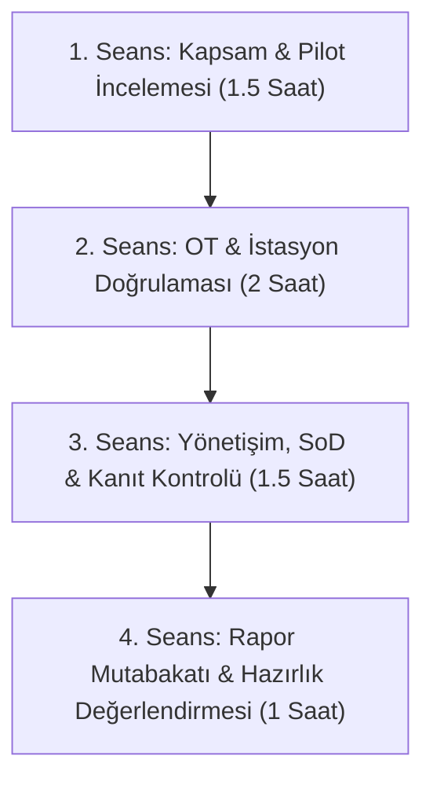

# ERP CRM Discovery — Uzman Saha İnceleme Rehberi (Expert Field Review Guide)

> **Belge Kodu:** `DOC-REV-FAZ67-001`  
> **Sürüm:** `v0.1.4`  
> **Hedef Kitle:** Kıdemli ERP/CRM Çözüm Mimarları, Endüstriyel Otomasyon (OT) Danışmanları, Kurumsal Süreç Liderleri, İç Denetim & SoD Uzmanları, Sistem Entegratörleri (MCS vb.)  
> **Gizlilik:** Açık Kaynak / Kurumsal İnceleme Rehberi  

---

## 1. İncelemenin Amacı ve Kapsamı

**ERP CRM Discovery**; işletmelerin ERP ve CRM dönüşüm yatırımları öncesinde saha gerçeklerini, süreç olgunluğunu, endüstriyel veri kaynaklarını (OT/IT), görevler ayrılığı (SoD) risklerini ve kanıt belgelerini yapılandırılmış bir modelle ortaya koyan **tarafsız (vendor-neutral), %100 çevrimdışı (offline-first)** bir analiz platformudur.

Bu rehberin amacı; bağımsız alan uzmanlarının ve kurumsal çözüm ortaklarının (MCS vb.) ERP CRM Discovery külliyatını, veri modelini ve raporlama çıktılarını metodolojik bir yaklaşımla denetleyebilmelerini sağlamaktır.

### Uzman İncelemesinin 5 Temel İlkesi:
1. **Tarafsızlık (Vendor-Neutrality):** Sorular ve süreçler belirli bir yazılım markasına (SAP, Microsoft Dynamics, IFS, Logo, Salesforce vb.) bağımlı olmamalı; evrensel en iyi uygulamaları (APQC, ISA-95, COSO) yansıtmalıdır.
2. **Saha Gerçekçiliği (Field Pragmatism):** Teorik mükemmellik yerine üretim sahasındaki fiili zorluklar (legacy makineler, PLC/SCADA kısıtları, operatör alışkanlıkları, yetki sapmaları) dikkate alınmalıdır.
3. **Kanıta Dayalı Doğrulama (Evidence-Driven Truth):** Beyan edilen süreçler fiziksel veya dijital kanıtlarla (tutanak, log, şartname, ekran görüntüsü) desteklenmelidir.
4. **Süreç Sadeliği ve Benimseme (Adoption Risk):** Aşırı karmaşık, kullanıcıyı bürokrasiye boğan süreç kurguları erken aşamada elenmelidir.
5. **Dürüst Karar Mekanizması:** Sistem asla otomatik bir "Go-Live onayı" vermez; nihai karar daima insan uzmanlara ve proje liderlerine aittir.

---

## 2. Hedef Uzman Profili

İnceleme heyeti aşağıdaki uzmanlık alanlarından en az birini temsil etmelidir:

| Uzman Rolü | Odak Alanı | Beklenen Katkı |
|---|---|---|
| **Kıdemli ERP Çözüm Mimarı** | Süreç entegrasyonu, modüller arası veri akışı, muhasebe/finans ve tedarik zinciri | Soru terminolojisi, modül sınırları ve gereksinimlerin netliği |
| **OT / Endüstriyel Otomasyon Danışmanı** | PLC, SCADA, sensör, OEE, kestirimci bakım, legacy makineler | OT istasyon hiyerarşisi, veri toplama sıklığı ve ISA-95 uyumu |
| **İç Denetim & Yetki (SoD) Uzmanı** | Görevler ayrılığı, onay limitleri, yetki sapmaları, KVKK/mevzuat | RACI matrisleri, kritik SoD çakışmaları ve imza yetkileri |
| **Süreç ve Kalite Yöneticisi** | BPMN süreç haritaları, darboğazlar, hata modları (FMEA), kalite cihazları | Süreç sadeliği, kabul kriterleri ve kullanıcı benimseme riski |
| **Proje Yöneticisi / PMO Lideri** | Zaman planı, bütçe, riskler, saha kabulü ve raporlama | Raporun icra kurulu ve proje komitesi nezdinde anlaşılırlığı |

---

## 3. İnceleme Yöntemi ve Değerlendirme Kriterleri

Uzman incelemesi 10 kritik başlık altında yapılandırılmıştır:

### 3.1 Soru Terminolojisi ve Tarafsızlık
- Sorular belirli bir yazılımın terimleriyle mi yazılmış, yoksa evrensel iş terimleri mi kullanılmış?
- Sorularda Türkçe kurumsal terminoloji tutarlı mı (örn. *Cari Kart*, *Müstahsil Makbuzu*, *Tevkifat*, *BOM*, *Rota*)?
- Seçenekler sektörel gerçekleri kapsıyor mu? `"is_other": true` esnekliği yeterli mi?

### 3.2 ERP Süreç Kapsamı ve Modül Sınırları
- 34 kanonik iş fonksiyonu arasındaki sınırlar belirgin mi?
- Aynı iş gereksinimi birden fazla modülde mükerrer sorulmuş mu?
- Zorunlu sorular (`is_required: true`) bir ön analiz için asgari kritik bilgiyi topluyor mu?

### 3.3 OT / PLC ve Endüstriyel Veri Gerçekçiliği
- İstasyon hiyerarşisi (`Plant -> Area -> Line -> Station -> Machine`) endüstriyel standartlara uygun mu?
- OT soruları PLC modellerini, haberleşme protokollerini (OPC-UA, Modbus, Profinet) ve veri sıklığını (saniye/dakika/vardiya) doğru sorguluyor mu?
- Enerji, sensör ve kalite veri gereksinimleri ERP/MES sınırlarıyla örtüşüyor mu?

### 3.4 Legacy Makine ve Dijitalleşemeyen Ekipman Yaklaşımı
- PLC/sensör çıkışı bulunmayan eski tip tezgahlar ve mekanik ekipmanlar için manuel/ara terminal çözümleri dikkate alınmış mı?
- "Makinada dijital çıkış yok" durumu açıkça modellenmiş mi?

### 3.5 Safety (İş Güvenliği) ve Entegrasyon Sınırları
- Güvenlik kilitleri, acil durdurma (E-Stop) ve operatör emniyeti gerektiren hatlarda doğrudan yazılımsal müdahale yapılmaması kuralı gözetilmiş mi?
- IT ağı ile OT üretim ağı arasındaki güvenlik ve izolasyon gereksinimleri sorulmuş mu?

### 3.6 Kalite Cihazları ve PDF-Only / İzole Ölçüm Senaryoları
- Kalibrasyon cihazları, 3D CMM veya laboratuvar test cihazlarının yalnızca PDF/kağıt rapor ürettiği senaryolar kapsanmış mı?
- Cihazdan ERP'ye otomatik veri akışı ile manuel operatör girişi ayrımı yapılmış mı?

### 3.7 Veri Sahipliği ve Görevler Ayrılığı (SoD)
- RACI matrisinde As-Is ve To-Be rolleri açıkça ayrılmış mı?
- Efektif yetki sapmaları (discrepancy) operasyonel yetersizlikleri mi yoksa kontrol zafiyetini mi gösteriyor?
- Parasal onay limitleri ve çok seviyeli onay mekanizmaları doğru modellenmiş mi?

### 3.8 Kanıt ve Saha Doğrulama Kaydı
- Beyan edilen her kritik süreç için fiziksel/dijital kanıt (belge, fotoğraf, log) istenmiş mi?
- Kanıt doğrulama durumu (`UNREVIEWED`, `REVIEWED`, `ACCEPTED`, `REJECTED`) ve güvenilirlik seviyesi net mi?
- Kanıtsız kritik konular (`unsupportedCriticalFindings`) raporda belirgin biçimde uyarılıyor mu?

### 3.9 Süreç Sadeliği ve Kullanıcı Benimseme Riski
- Süreç haritalarındaki düğüm sayısı, karar noktaları ve onay döngüleri süreç karmaşıklığı skorunu doğru yansıtıyor mu?
- Aşırı bürokratik süreçler için benimseme riski (Adoption Risk) uyarısı veriliyor mu?

### 3.10 Raporun Karar Vericiler Tarafından Kullanılabilirliği
- Yönetici Özeti (Executive Summary) ve Genel Değerlendirme üst yönetime net bir vizyon sunuyor mu?
- Rapor çıktıları (HTML, DOCX, PDF) birebir aynı rakamları ve metinleri gösteriyor mu?
- Raporda hiçbir yerde `undefined`, `null` veya `Invalid Date` hatası bulunmadığı doğrulanmış mı?

---

## 4. Puanlama Yöntemi ve Bulguların Sınıflandırılması

Uzman incelemesinde tespit edilen konular 3 seviyede sınıflandırılır:

```
[KRİTİK KUSUR] ───► Sistemin yanlış veya tehlikeli bir ERP/OT kararı vermesine yol açabilecek hata.
[ÖNERİ]        ───► Süreç olgunluğunu veya soru derinliğini artıran yapısal tavsiye.
[İYİLEŞTİRME]  ───► Arayüz, terminoloji veya görsel çıktı ergonomisine dair iyileştirme.
```

### Sonuç Durumları (Review Status):
- **`NOT_REVIEWED`:** Henüz uzman incelemesine alınmamış.
- **`REVIEWED`:** Uzman incelemesi tamamlanmış, bulgular raporlanmış.
- **`ACCEPTED`:** Uzman tarafından kontrol edilmiş ve sahaya uygun bulunmuş.
- **`NEEDS_REVISION`:** Düzeltilmesi gereken kritik kusur veya öneriler mevcut.
- **`BLOCKED`:** Temel mimari veya terminolojik engel nedeniyle kabul edilemiyor.

> [!CAUTION]
> **Sahte Olumlu Yasağı:**  
> Gerçek bir insan uzman görüşü alınmadan sistemin veya yazılımın "Uzman tarafından onaylandı (ACCEPTED)" şeklinde otomatik bir sonuç üretmesi kesinlikle yasaktır. İnceleme durumu varsayılan olarak `NOT_REVIEWED` başlar.

---

## 5. Çözüm Ortağı / Sistem Entegratörü (MCS vb.) Görüşme Akışı

Saha inceleme toplantıları 4 aşamalı standart bir protokol ile yürütülür:



### Seans 1: Kapsam ve Pilot Ön İncelemesi
- Marmara Endüstriyel Sistemler A.Ş. sentetik pilotunun yüklenmesi.
- 19 aktif iş fonksiyonunun ve cevap dağılımının incelenmesi.
- Soru formülasyonlarının ve seçenek kapsamının denetlenmesi.

### Seans 2: Endüstriyel OT ve İstasyon Doğrulaması
- 11 OT istasyonunun üretim sahası hiyerarşisiyle karşılaştırılması.
- PLC modelleri (Siemens S7-1500, Mitsubishi, Beckhoff), sensörler ve enerji analizörlerinin doğrulanması.
- Kalite kontrol cihazları ve legacy makinelerin veri toplama sınırlarının çizilmesi.

### Seans 3: Veri Sahipliği, Yetki Matrisi ve Kanıt Kontrolü
- RACI sorumluluk matrisinin gözden geçirilmesi.
- Satın alma, ambar ve faturalama arasındaki SoD çakışmalarının değerlendirilmesi.
- Eklenen kanıt dokümanlarının doğrulanması ve kanıtsız kritik konuların tespiti.

### Seans 4: Rapor Mutabakatı ve Keşif Hazırlığı Değerlendirmesi
- HTML önizleme, DOCX ve PDF çıktılarının karşılaştırılması.
- Bölüm 7 Keşif Hazırlık Skoru (%XX) ve açık aksiyon listesinin gözden geçirilmesi.
- Uzman İnceleme Tutanağının imzalanması / onaylanması.

---

## 6. Uzman İnceleme Tutanağı Şablonu

```text
======================================================================
ERP CRM DISCOVERY — UZMAN SAHA İNCELEME TUTANAĞI
======================================================================
Tarih: .........................
İnceleyen Uzman / Kurum: .........................
Uzmanlık Alanı: [ ] ERP Mimarı  [ ] OT/Endüstriyel  [ ] Denetim/SoD  [ ] Kalite/Süreç

İNCELENEN PROJE: Marmara Endüstriyel Sistemler A.Ş. (Sentetik Pilot)
UYGULAMA SÜRÜMÜ: v0.1.4 (SQLite Schema v19)

DEĞERLENDİRME SONUCU:
[ ] ACCEPTED (Saha İncelemesine Uygun)
[ ] NEEDS_REVISION (Düzeltme Gerektiriyor)
[ ] BLOCKED (Kritik Engel Mevcut)

ÖZET BULGULAR VE GÖRÜŞLER:
......................................................................
......................................................................

Uzman İmzası: .........................
======================================================================
```
